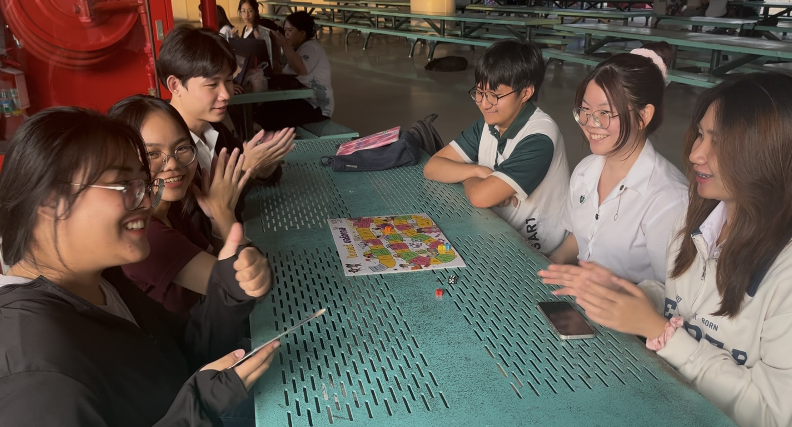
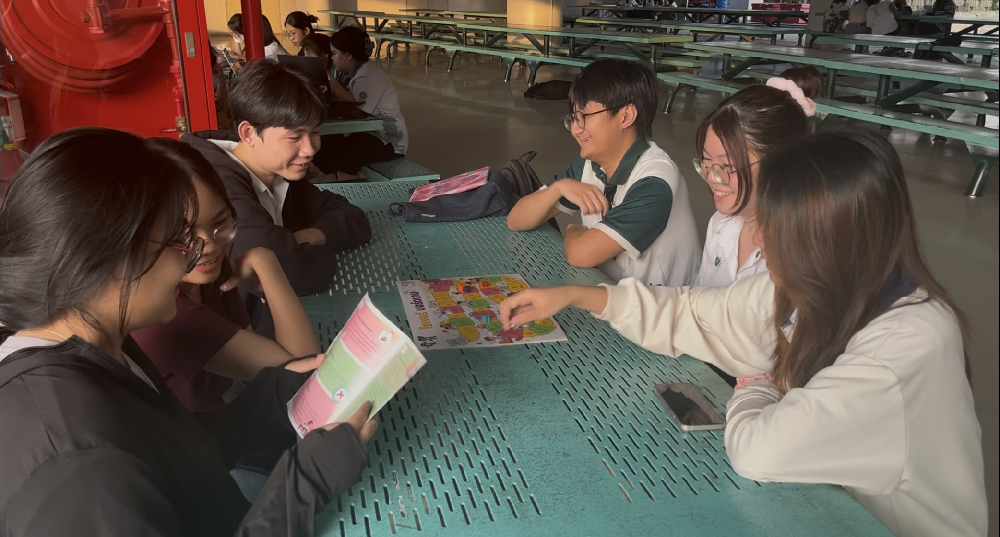

<h1>🎲 NCSA Boardgame Activity with Manoi Group</h1>

---

> Cybersecurity is not just about systems and technology — it's about people. Train the human, secure the system.

**รายละเอียดกิจกรรม**

---

กลุ่มนิสิตจากสาขาวิชาวิทยาการคอมพิวเตอร์ภายใต้ชื่อ “Manoi” ได้จัดกิจกรรมเพื่อสร้างความตระหนักรู้บนโลกไซเบอร์เมื่อวันที่ **24 มกราคม 2568 เวลา 17:00น.**  
ณ **ตึก 17 มหาวิทยาลัยเกษตรศาสตร์ วิทยาเขตศรีราชา** ให้กับนิสิตคณะวิทยาการจัดการ สาขาการบัญชี  

กิจกรรมนี้ใช้บอร์ดเกมที่พัฒนาโดย **สำนักงานคณะกรรมการการรักษาความมั่นคงปลอดภัยไซเบอร์แห่งชาติ (สกมช.) หรือ NCSA**  
ซึ่งมีผู้เข้าร่วมกิจกรรมจำนวนทั้งหมด 6 คน  
- นิสิตสาขาการบัญชี 2 คน  
- ตัวแทนจากสมาชิกกลุ่มผู้จัดทำอีก 4 คน
- ตัวแทนถ่ายวีดีโอกิจกรรม 1 คน

ภาพบรรยากาศ 1            |  ภาพบรรยากาศ 2
:-------------------------:|:-------------------------:
! |   
 
ภาพบรรยากาศ 3            |  ภาพบรรยากาศ 4
:-------------------------:|:-------------------------:
 |   

**สิ่งที่ได้รับจากกิจกรรม**

---

กิจกรรมในครั้งนี้ถือว่าเป็นโอกาสที่ดีในการเสริมสร้างความเข้าใจและตระหนักรู้เกี่ยวกับความมั่นคงปลอดภัยไซเบอร์ให้แก่ผู้เข้าร่วมกิจกรรม  

- การแลกเปลี่ยนแนวคิดและแนวปฏิบัติช่วยให้ผู้เข้าร่วมสามารถเข้าใจถึง **ความเสี่ยงและการป้องกันภัยในโลกไซเบอร์ได้ดียิ่งขึ้น**  
- กิจกรรมยังช่วยส่งเสริมให้เกิด **พฤติกรรมที่ปลอดภัยในสังคมดิจิทัลได้อย่างมีประสิทธิภาพ**

**วิดีโอบรรยากาศกิจกรรม**

---

> ทั้งนี้ทางกลุ่มผู้จัดได้ขออนุญาตผู้เข้าร่วมถ่ายภาพและวิดีโอเพื่อบันทึกภาพกิจกรรมดังกล่าวเรียบร้อยแล้ว

**สมาชิกกลุ่ม** 

---

- [Chonnikarn Sangwang](https://nixe97.github.io/boardgame) 
- [Natnicha Nontraudon](https://ohalic.github.io/boardgame)  
- [Supawadee Muangprasert](https://donyweasley.github.io/boardgame/) 
- [Jakapob Siwakulrangsun](https://ioosck4.github.io/boardgame)
- [Tanatorn Jitsatsawan](https://6530200207.github.io/boardgame)
