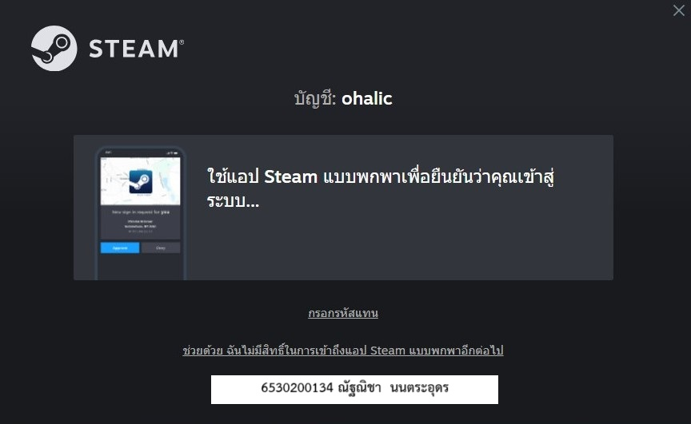
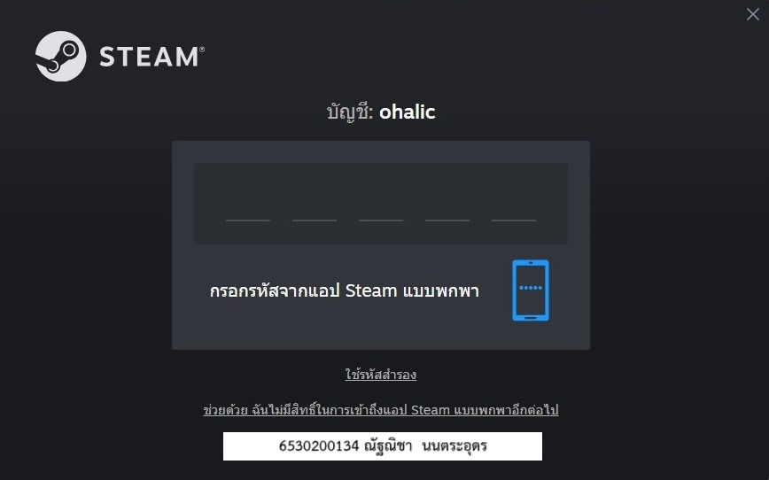
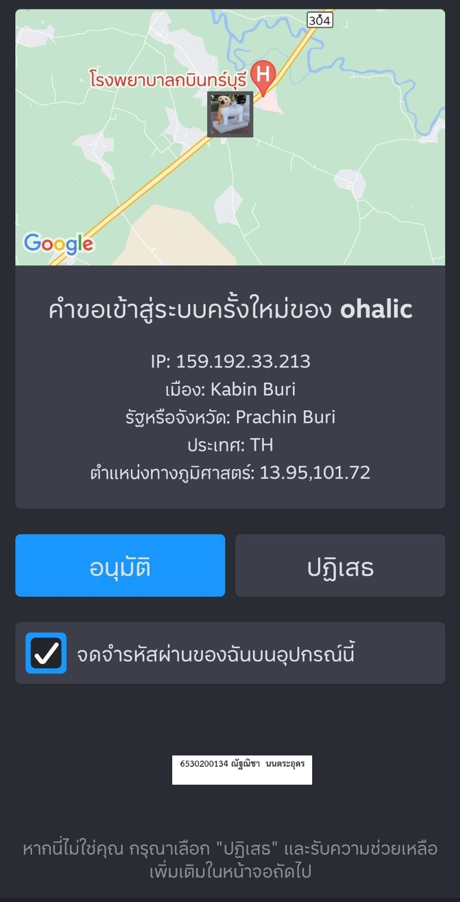
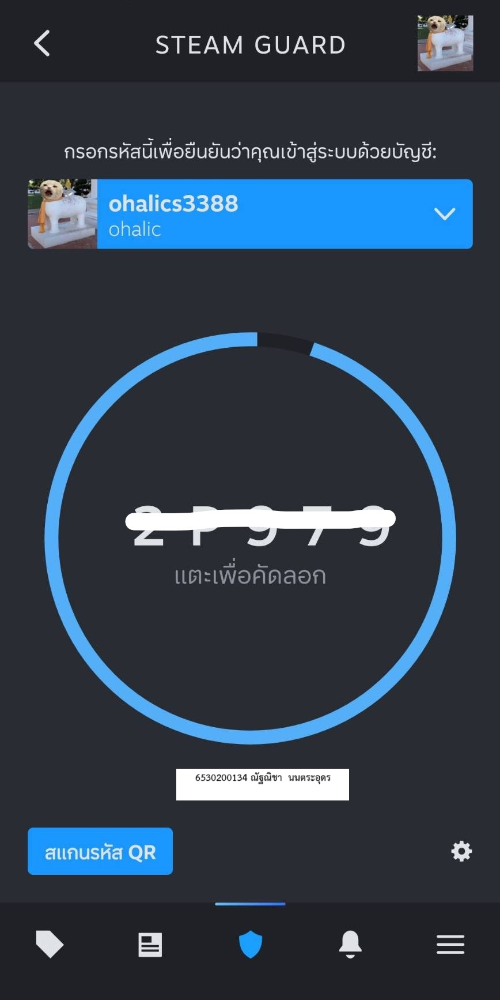

# 🔐 Security Control

สถานที่ : เข้าสู่ระบบ Steam ใน notebook ของตัวเอง

---

## Steam guard คืออะไร
Steam Guard คือระบบรักษาความปลอดภัยของ Steam ที่**ถูกออกแบบมาเพื่อป้องกันบัญชีผู้ใช้จากการถูกแฮ็กหรือการเข้าถึงที่ไม่ได้รับอนุญาต** **โดยการเพิ่มการยืนยันตัวตนสองขั้นตอน (2FA)** ผ่านแอป Steam Mobile หรืออีเมล เพื่อเพิ่มความมั่นใจว่าเจ้าของบัญชีเป็นผู้ที่มีสิทธิ์จริงๆ ในการเข้าถึงบัญชีนั้น

-  หน้าที่ของ Steam Guard
  > การยืนยันตัวตนเพิ่มเติม: ช่วยเพิ่มความปลอดภัยให้กับบัญชีผู้ใช้โดยการตรวจสอบสองขั้นตอน ในกรณีที่มีการเข้าสู่ระบบจากอุปกรณ์ใหม่

  > การป้องกันบัญชีจากการแฮ็ก: เมื่อเปิดใช้งาน Steam Guard บัญชีจะปลอดภัยจากการถูกแฮ็ก แม้จะรู้รหัสผ่าน แต่ถ้าหากไม่มีการยืนยันตัวตนจากอุปกรณ์ที่เชื่อถือได้ จะไม่สามารถเข้าถึงบัญชีได้

  
-  ฟังก์ชันที่เกี่ยวข้อง
  > Steam Guard Mobile Authenticator: แอปที่ใช้สำหรับรับรหัสยืนยันตัวตนที่ใช้ในการเข้าสู่ระบบ
  > Steam Guard Email Verification: การส่งรหัสยืนยันไปยังอีเมลที่ลงทะเบียน เพื่อให้ผู้ใช้ยืนยันก่อนเข้าสู่ระบบ
  
-  Type of Security Control 
  > Preventive Control : การใช้ Steam Guard เป็นการป้องกันการเข้าถึงที่ไม่ได้รับอนุญาต โดยการเพิ่มการยืนยันตัวตน
  > Detective Control : ช่วยให้ผู้ใช้สามารถตรวจสอบว่ามีการพยายามเข้าถึงบัญชีจากอุปกรณ์ที่ไม่รู้จักหรือไม่
  
-  Control Function 
  > Authentication: ฟังก์ชันการยืนยันตัวตนสองขั้นตอนเป็นการตรวจสอบความถูกต้องของผู้ใช้เมื่อทำการเข้าสู่ระบบ
  > Access Control: ควบคุมการเข้าถึงบัญชีผู้ใช้จากอุปกรณ์ที่ไม่ได้รับอนุญาต
    
การใช้ Steam Guard จะช่วยเพิ่มความมั่นใจในการปกป้องข้อมูลส่วนตัวและการทำธุรกรรมภายใน Steam โดยเฉพาะในกรณีที่บัญชีของคุณมีข้อมูลการชำระเงินหรือการซื้อขายในตลาด Steam
